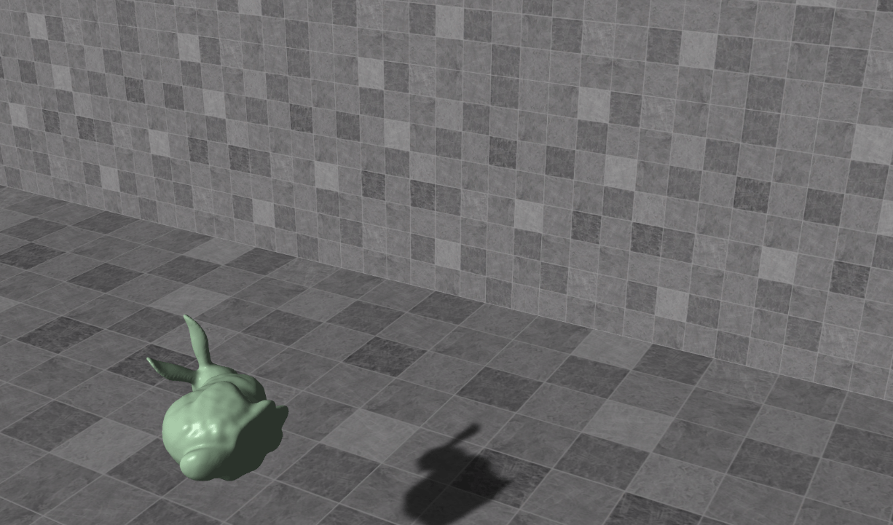
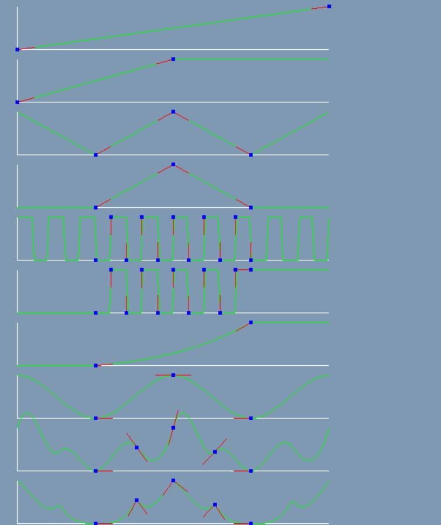
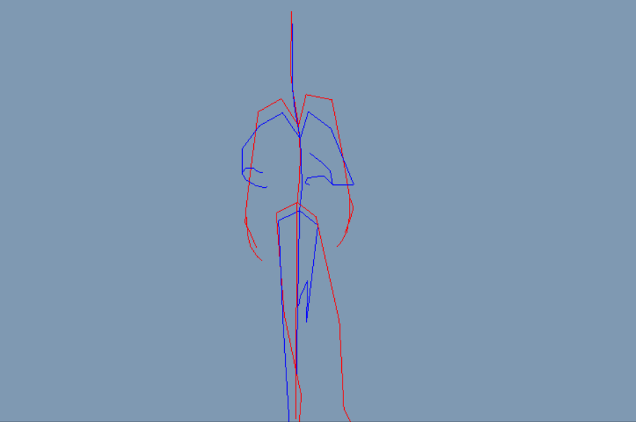
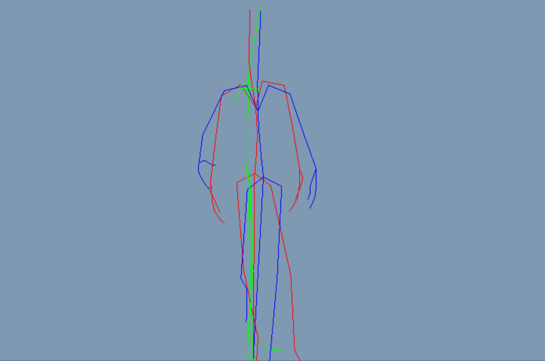
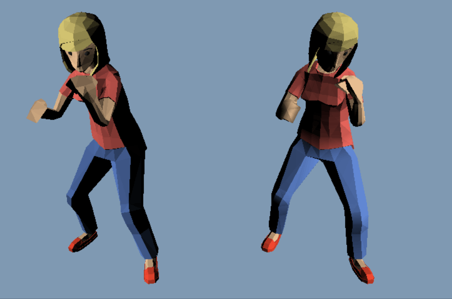
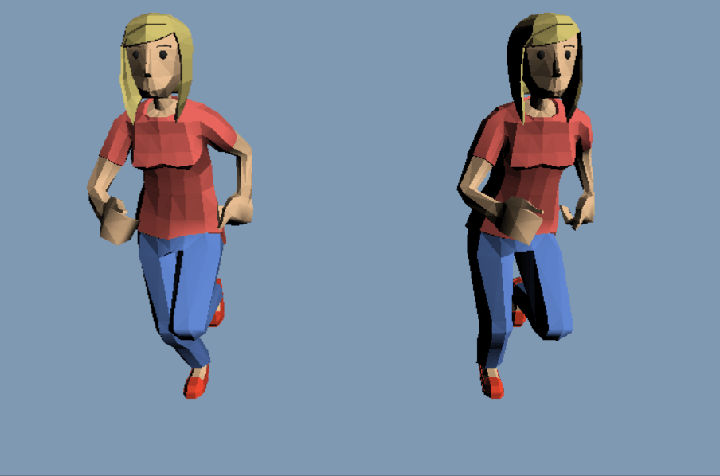

# AnimationLearn
 
## Games 103

### Rigid body simulation

### Rigid body simulation by shape matching

### Cloth simulation by implicit model

### Cloth simulation by PBD model

## Game Aniamtion

### Curves

### Play run animation clip and display rest pose

### Play run animation clip and display rest pose and bind pose

### Skin (left: CPU | right: GPU)

### Optimize animation pipeline (left: CPU skin| right: GPU skin)

